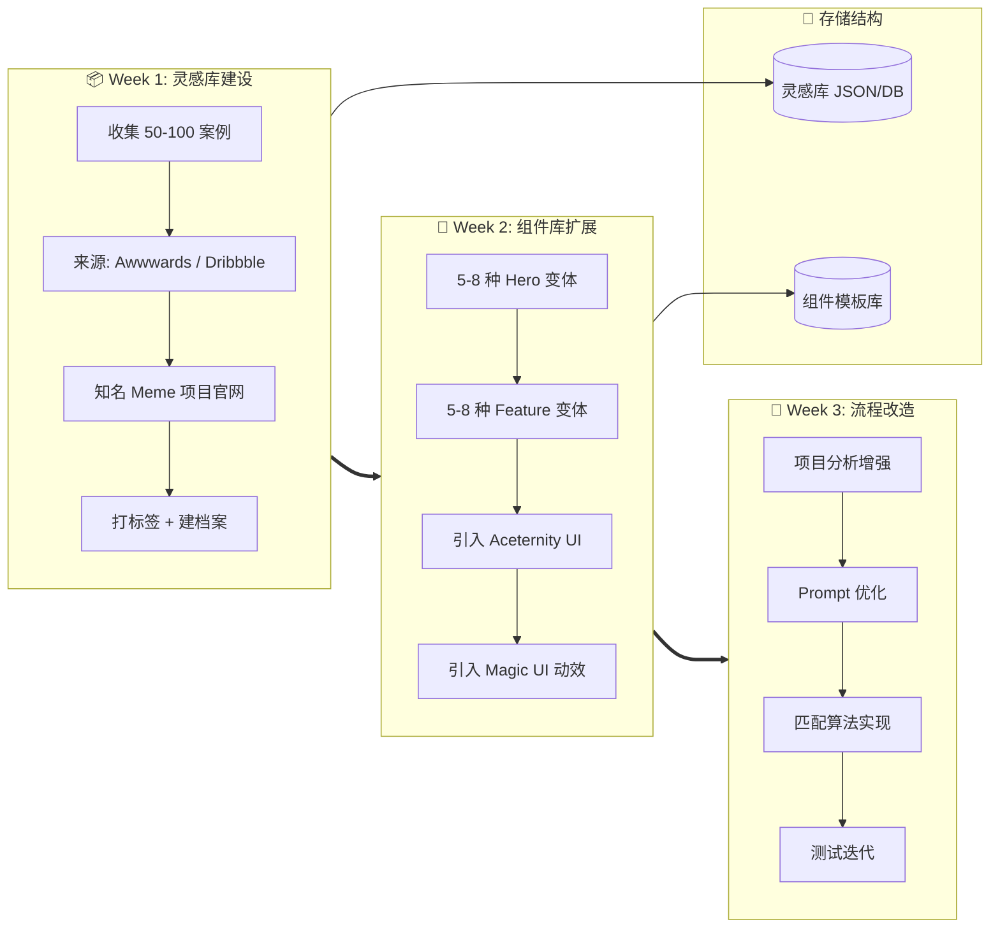
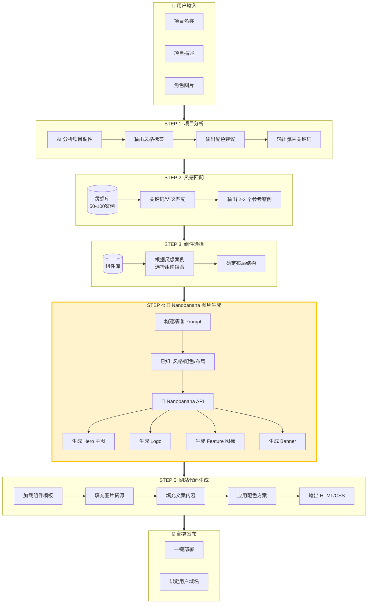
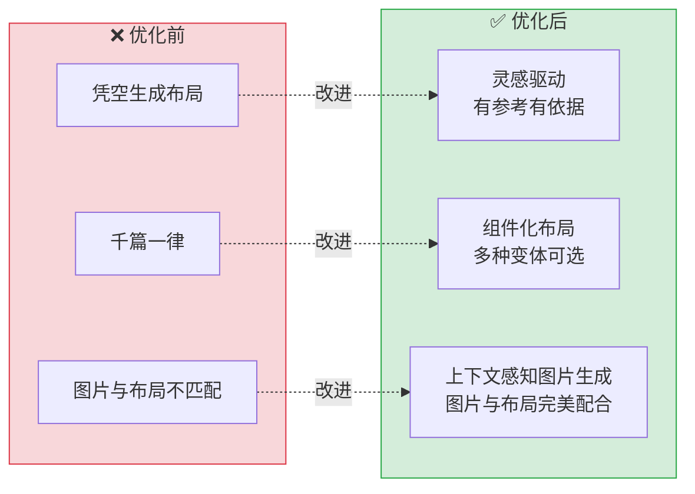
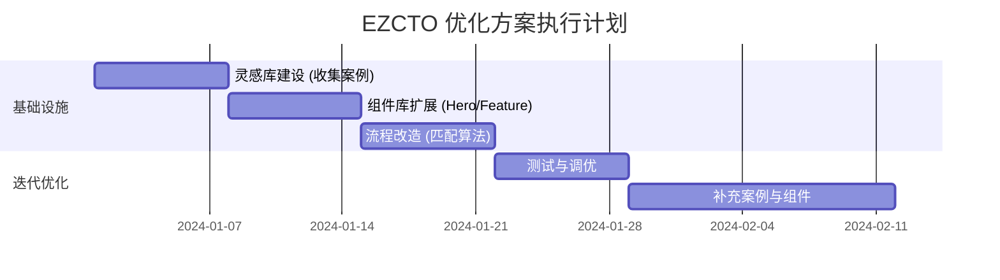

# EZCTO 网站生成系统 - 优化方案架构

## 一、基础设施建设（一次性工作）



### 灵感库数据结构

```json
{
  "id": "pepe-001",
  "name": "Pepe Official",
  "tags": ["可爱", "卡通", "复古像素"],
  "layout": {
    "hero": "居中大图",
    "feature": "卡片网格"
  },
  "colors": {
    "primary": "#4CAF50",
    "background": "#FFFFFF"
  },
  "screenshot_url": "s3://...",
  "suitable_for": ["动物类", "可爱类", "经典Meme"]
}
```

### 组件清单

| 类型 | 组件名称 | 描述 |
|------|---------|------|
| Hero | `centered-hero` | 居中大图 + 底部文字 |
| Hero | `split-left` | 左文右图 |
| Hero | `split-right` | 右文左图 |
| Hero | `fullscreen-bg` | 全屏背景 + 居中内容 |
| Hero | `diagonal-cut` | 斜切分割式 |
| Feature | `card-grid` | 三列卡片网格 |
| Feature | `bento-grid` | Bento 不规则网格 |
| Feature | `timeline` | 时间线/路线图 |
| Feature | `alternating` | 左右交替图文 |
| CTA | `gradient-cta` | 渐变背景 + 动画按钮 |

---

## 二、用户生成流程（每次执行）



---

## 三、Nanobanana 图片生成详解

```mermaid
flowchart LR
    subgraph Context["📋 已知上下文"]
        C1["风格: 赛博朋克"]
        C2["配色: #00ff88"]
        C3["布局: 斜切分割"]
        C4["Hero图位置: 右侧"]
        C5["需要图标: 4个"]
    end

    subgraph Prompt["📝 构建 Prompt"]
        P1["风格描述"]
        P2["构图要求"]
        P3["配色协调"]
        P4["氛围关键词"]
    end

    subgraph Nanobanana["🍌 Nanobanana"]
        N1["图片生成 API"]
    end

    subgraph Results["🖼️ 生成结果"]
        R1["Hero 主图\n竖版/角色朝左"]
        R2["Logo\n风格统一"]
        R3["Feature 图标\n×4"]
        R4["Banner\n社交媒体用"]
    end

    Context --> Prompt
    Prompt --> Nanobanana
    Nanobanana --> Results
```



### 优化后的 Prompt 示例

```
生成赛博朋克风格角色图，
竖版构图，角色位于画面中央偏右，面朝左侧，
背景使用 #0a0a0f 到 #1a1a2e 渐变，
添加霓虹绿(#00ff88)光效，
整体氛围：未来感、数字化、神秘
```

---

## 四、关键改进点



---

## 五、执行时间表



---

## 六、技术栈

| 模块 | 技术选型 |
|------|---------|
| 灵感库存储 | JSON / MySQL |
| 组件库 | Aceternity UI + Magic UI + 自定义 |
| 匹配算法 | 关键词匹配 → Embedding 语义匹配 |
| 图片生成 | Nanobanana API |
| 网站生成 | HTML/CSS + Tailwind |
| 部署 | Manus 托管 |
